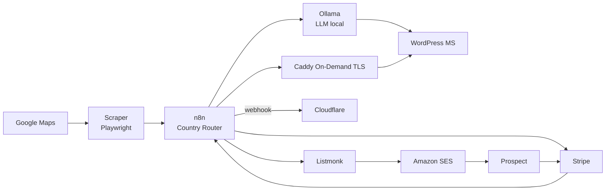

# oueb — usine logicielle One-Page (100% Open Source, self-hosted)

Chaîne automatisée : **scraping de leads sans site → génération IA localisée →
clonage WordPress MultiSite → Payment Link Stripe multi-devises → cold email
Listmonk/SES → TLS à la volée Caddy** sur le domaine du client après paiement.

Marchés cibles : 🇨🇭 Suisse · 🇱🇮 Liechtenstein · 🇲🇨 Monaco · 🇸🇬 Singapour · 🇯🇵 Japon.
Prix : 500 CHF / EUR / USD et **79 800 JPY** (500 JPY ≈ 3 USD — voir
`config/country_matrix.yaml`).

100% OSS : **n8n · Playwright · Ollama · WordPress MultiSite · Listmonk · Caddy**.
Un seul point d'entrée réseau (Caddy). Diagrammes complets : [`docs/architecture.md`](docs/architecture.md).



## Arborescence

```
oueb/
├── docker-compose.yml            # n8n · postgres · listmonk · wordpress · mariadb · scraper · ollama · caddy
├── .env.example                  # tous les secrets/paramètres
├── docker/
│   ├── caddy/Caddyfile           # reverse proxy + On-Demand TLS (ask → n8n)
│   ├── postgres/init.sql         # crée les bases n8n + listmonk
│   └── wordpress/sunrise.php     # résolution des domaines clients mappés
├── scraper/                      # FastAPI + Playwright (leads Google Maps sans site)
│   ├── Dockerfile
│   ├── requirements.txt
│   └── app.py                    # POST /scrape
├── n8n-workflows/
│   └── README.md                 # 3 workflows + node "Country Router" (JS)
├── wordpress-plugin/
│   └── oueb-provisioner.php       # MU-plugin : REST /oueb/v1/sites (clone + inject SEO)
├── scripts/
│   ├── inject_site.py            # client REST du provisioner
│   ├── bootstrap_wp.sh           # install + conversion MultiSite (wp-cli)
│   └── requirements.txt
├── config/
│   ├── country_matrix.yaml       # devise/locale/prompt/prix par pays
│   └── prompts.md                # profils LLM (keigo JP, allemand LI, …)
├── listmonk/config.toml          # bootstrap Listmonk (SES via UI)
└── docs/
    ├── architecture.md           # schémas Mermaid détaillés
    └── compliance.md             # SES, opt-in JP, RGPD/PDPA/nLPD, scraping ToS
```

## Démarrage (ordre important)

```bash
cp .env.example .env && $EDITOR .env          # remplir secrets + MAIN_DOMAIN

docker compose up -d postgres wpdb            # bases d'abord
docker compose run --rm listmonk ./listmonk --install --yes   # schéma Listmonk (1x)
docker compose up -d                          # tout le reste

# WordPress : résoudre le poulet-œuf MultiSite, puis activer les constantes
MAIN_DOMAIN=oueb.example WP_ADMIN_PASSWORD='...' ./scripts/bootstrap_wp.sh
sed -i 's/^OUEB_MULTISITE_READY=.*/OUEB_MULTISITE_READY=1/' .env
docker compose up -d wordpress

# Modèle LLM local
docker compose exec ollama ollama pull qwen2.5:14b-instruct

# Créez un SITE TEMPLATE dans le réseau WP (design one-page) -> notez son blog_id
# = template_id utilisé par le provisioner.
```

Pointez ensuite `MAIN_DOMAIN` (A record) vers l'IP du VPS. Caddy obtient son
certificat, la console n8n est sur `/n8n/`, Listmonk sur `/listmonk/`.

## Prérequis DNS/TLS pour les sites clients

Le client fait pointer son domaine (A record) vers l'IP du VPS. À la première
visite, Caddy demande à n8n (`/webhook/tls-authorize`) si le domaine est un client
**payé et actif** (table `client_domains`) ; si oui, il émet le certificat Let's
Encrypt à la volée. Le garde-fou empêche l'émission pour des domaines arbitraires.

## Contrôles

```bash
python3 scraper/app.py            # selfcheck parsing (hors-ligne)
python3 scripts/inject_site.py --selftest
```

## ⚠️ Avant la production — lire `docs/compliance.md`

Le cold email de masse est **strictement encadré** sur ces 5 marchés (opt-in
obligatoire au Japon, nLPD/UWG en Suisse, RGPD à Monaco, PDPA à Singapour) et le
scraping Google Maps viole les CGU Google. SES exige domaine vérifié + SPF/DKIM/DMARC
+ warm-up + gestion des bounces. Ciblez B2B, gardez l'opt-out actif, excluez le JP
du cold-email pur.
