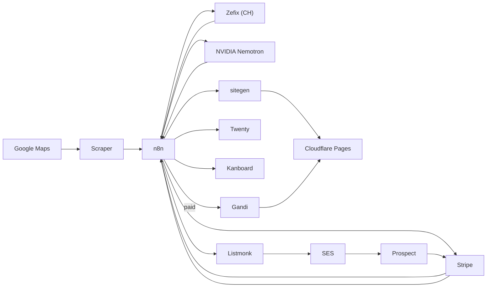

# oueb — usine logicielle One-Page (100% Open Source, self-hosted)

Chaîne automatisée : **scraping de leads sans site → validation registre (Zefix) →
génération IA localisée → site statique déployé sur Cloudflare Pages → Payment Link
Stripe multi-devises (méthodes locales) → cold email Listmonk/SES**, avec **Twenty
CRM** et **Kanboard** pour le suivi. À l'encaissement : achat de domaine (Gandi) et
mise en ligne automatique.

Le générateur compose désormais chaque page selon le métier : atelier,
éditorial, précision ou hospitalité. Il conserve un seul HTML statique, mais
adapte typographie, rythme, palette et traitement d’image. Le contrat et les
principes visuels sont documentés dans [`DESIGN.md`](DESIGN.md).

Marchés cibles : 🇨🇭 Suisse · 🇱🇮 Liechtenstein · 🇲🇨 Monaco · 🇸🇬 Singapour · 🇯🇵 Japon · 🇺🇸 USA.
Prix : 500 CHF / EUR / SGD / USD et **79 800 JPY**. Paiements locaux : TWINT (CH/LI),
PayNow (SG), Konbini (JP), ACH/Link (US).

OSS self-hosted (LLM via **endpoint NVIDIA Nemotron**) : **n8n · Playwright · Cloudflare Pages · Listmonk · Twenty · Kanboard
· Caddy**. Le VPS n'héberge que le **control-plane** ; les sites clients vivent sur
l'edge Cloudflare (TLS + CDN mondial gratuits). Schémas : [`docs/architecture.md`](docs/architecture.md).



## Arborescence

```
oueb/
├── docker-compose.yml   # caddy·postgres·redis·n8n·listmonk·twenty(+worker)·kanboard·sitegen·scraper (LLM = NVIDIA externe)
├── .env.example
├── docker/
│   ├── caddy/Caddyfile          # reverse proxy back-office (TLS Let's Encrypt)
│   └── postgres/init.sql        # bases n8n · listmonk · twenty · kanboard
├── sitegen/                     # one-page statique + déploiement Cloudflare Pages
│   ├── server.js · build.js · template.html · package.json · Dockerfile
├── scraper/                     # FastAPI + Playwright (leads Google Maps sans site)
├── n8n-workflows/               # 2 workflows importables (JSON) + README
├── config/
│   ├── country_matrix.yaml      # devise/locale/prompt/prix/paiement par pays
│   ├── prompts.md               # profils LLM (keigo JP, de LI, ch_fr/it, us_en…)
│   └── registries.md            # Zefix (CH) + registres JP/SG/LI/MC/US
├── clients/                     # une fiche JSON par prospect (photos hors dépôt)
│   ├── _modele.json             # gabarit à copier
│   └── garage-du-centre.json    # exemple de référence, déployé
├── tools/                       # outillage de production des démos
│   ├── prospect-geo.mjs         # adresse -> coordonnées + cap Street View
│   ├── sign-colors.ps1          # relevé des couleurs d'une enseigne
│   ├── crop-photo.ps1           # recadrage web aux rapports du gabarit
│   ├── deploy-client.mjs        # déploie une fiche (+ --paid après paiement)
│   └── verify-live.mjs          # contrôle structurel de la page publiée
├── listmonk/config.toml
└── docs/
    ├── architecture.md          # schémas Mermaid
    ├── hosting-registrar.md      # Cloudflare Pages + matrice registrars
    ├── production-client.md      # ⭐ mode opératoire complet, du prospect au site livré
    ├── browser-backends.md       # Chromium local vs Kitesurf (Cloudflare Browser Run)
    ├── deploy-cloudflare.md      # token, déploiement Pages, livraison post-paiement
    └── compliance.md            # SES, opt-in JP, RGPD/PDPA/nLPD/CAN-SPAM, scraping
```

## Démarrage

```bash
cp .env.example .env && $EDITOR .env          # secrets + MAIN_DOMAIN

docker compose up -d postgres redis
docker compose run --rm listmonk ./listmonk --install --yes   # schéma Listmonk (1x)
docker compose up -d

# LLM = endpoint NVIDIA (aucun modèle local). Mets NVIDIA_API_KEY dans .env
# (en prod : lu depuis OCI Vault au boot via instance principal).

# Comptes back-office (pointez MAIN_DOMAIN vers l'IP du VPS d'abord) :
#  - Twenty   : https://$MAIN_DOMAIN            -> créer le workspace, puis Settings > API (TWENTY_API_KEY)
#  - Kanboard : https://$MAIN_DOMAIN/kanboard    -> login admin/admin (à changer), créer un projet (project_id=1)
#               + activer l'API JSON-RPC (Settings > API) -> KANBOARD_API_TOKEN = base64("jsonrpc:<token>")
#  - Listmonk : https://$MAIN_DOMAIN/listmonk     -> Settings > SMTP (Amazon SES) + API token

# Cloudflare : créer un API token (scope Pages:Edit) + noter l'Account ID -> .env (sitegen)
# Reporter les tokens dans .env puis :
docker compose up -d n8n sitegen

# Importer n8n-workflows/1-outreach.json et 2-provisioning.json, assigner les
# credentials, activer les workflows.
```

## Hébergement des sites & domaines

Les one-pages sont **statiques** (service `sitegen`) et déployés sur **Cloudflare
Pages** (TLS + CDN mondial gratuits — un client JP est servi depuis Tokyo). Après
paiement, le workflow 2 achète le domaine (**Gandi**, couvre .ch/.li/.jp/.com),
`sitegen` le rattache au projet Pages, et un CNAME LiveDNS pointe le domaine vers
`<projet>.pages.dev`. Détails et matrice registrar : [`docs/hosting-registrar.md`](docs/hosting-registrar.md).

## Contrôles

Les deux selfchecks tournent hors-ligne (aucun réseau, aucun conteneur), mais
demandent les dépendances installées une fois :

```bash
# scraper (venv gitignoré)
python3 -m venv scraper/.venv
scraper/.venv/bin/pip install -r scraper/requirements.txt   # Windows : scraper\.venv\Scripts\pip
scraper/.venv/bin/python scraper/app.py     # -> selfcheck: OK  (parsing + endpoint CDP)

# sitegen
npm --prefix sitegen install
node sitegen/build.js                       # -> selfcheck: OK  (échappement + filigrane)
npm --prefix sitegen run preview             # 4 directions dans .artifacts/oueb-preview

docker compose config --quiet               # valide le compose + le .env
```

## Produire la démo d'un prospect

Le mode opératoire complet — qualification, relevé de charte, photos, rédaction,
déploiement, contrôle, livraison — est dans
[`docs/production-client.md`](docs/production-client.md). En bref :

```bash
node tools/prospect-geo.mjs "Rue du Centre 9, 1023 Crissier, Suisse"  # cap Street View
cp clients/_modele.json clients/mon-prospect.json && $EDITOR clients/mon-prospect.json
node tools/deploy-client.mjs clients/mon-prospect.json                # démo filigranée
node tools/verify-live.mjs https://oueb-mon-prospect.pages.dev        # contrôle
# après encaissement :
node tools/deploy-client.mjs clients/mon-prospect.json --paid
```

## Filigrane des démos

Les one-pages envoyés en prospection sont **filigranés par défaut** : bandeau
« APERÇU · NON PAYÉ » avec lien de paiement, motif diagonal répété, et
`robots: noindex,nofollow` pour qu'une démo ne soit jamais indexée (elle
concurrencerait le futur vrai site du client).

```bash
POST /deploy {slug, lang, seo, pay_url}                    # filigrané (défaut)
POST /deploy {slug, lang, seo, watermark: false}           # livraison post-paiement
```

Seul un `watermark: false` **explicite** retire le filigrane : le workflow 2
redéploie le même slug après encaissement Stripe, ce qui produit un site propre
et indexable. Le CSS du filigrane est injecté à la génération, donc un site payé
n'en garde aucune trace dans son source.

⚠️ Le filigrane est du HTML/CSS côté client : il décourage la réutilisation,
il ne l'empêche pas techniquement. C'est un marqueur commercial, pas un DRM.

## Backend navigateur (scraper)

`BROWSER_BACKEND=local` (Chromium dans le conteneur, défaut) ou `kitesurf`
(Cloudflare Browser Run — 3–4× moins de CPU, 5–7× moins de RAM). Kitesurf parle
le CDP, donc le code Playwright est inchangé. **Attention** : il ne passe pas les
challenges anti-bot TLS, donc probablement pas utilisable sur Google Maps —
détails, quotas et cas d'usage adaptés dans
[`docs/browser-backends.md`](docs/browser-backends.md).

## ⚠️ Avant la production — [`docs/compliance.md`](docs/compliance.md)

Cold email strictement encadré (opt-in JP, nLPD/UWG CH, RGPD MC, PDPA SG, CAN-SPAM
US) et scraping Google Maps hors-CGU. SES : domaine vérifié + SPF/DKIM/DMARC +
warm-up + gestion bounces. Ciblez **B2B**, gardez l'opt-out actif, **excluez le JP
du cold-email pur**.
