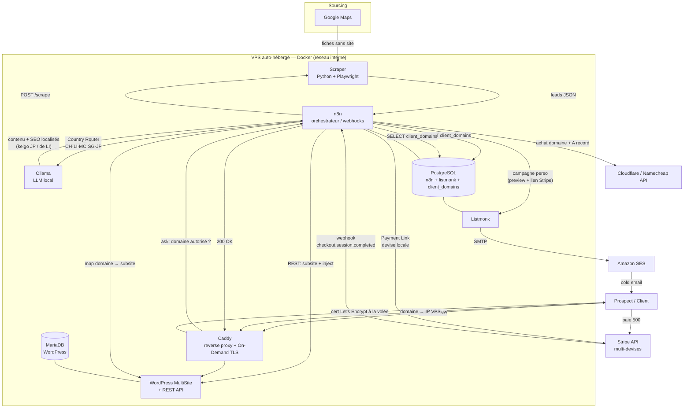
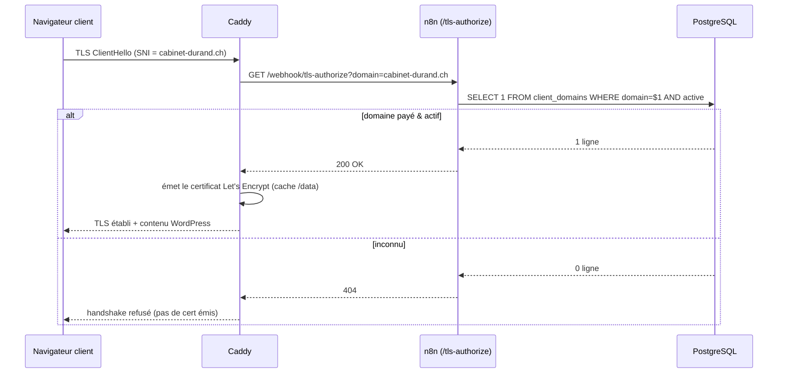

# Architecture

## Flux de données (scraping → vente → TLS à la volée)

```mermaid
flowchart TD
  subgraph SRC["Sourcing"]
    GM["Google Maps"]
  end

  subgraph VPS["VPS auto-hébergé — Docker (réseau interne)"]
    CADDY["Caddy<br/>reverse proxy + On-Demand TLS"]
    N8N["n8n<br/>orchestrateur / webhooks"]
    SCR["Scraper<br/>Python + Playwright"]
    OLL["Ollama<br/>LLM local"]
    WP["WordPress MultiSite<br/>+ REST API"]
    LM["Listmonk"]
    PG[("PostgreSQL<br/>n8n + listmonk + client_domains")]
    MDB[("MariaDB<br/>WordPress")]
  end

  STRIPE["Stripe API<br/>multi-devises"]
  SES["Amazon SES"]
  DNS["Cloudflare / Namecheap API"]
  CLIENT["Prospect / Client"]

  GM -->|"fiches sans site"| SCR
  N8N -->|"POST /scrape"| SCR
  SCR -->|"leads JSON"| N8N
  N8N -->|"Country Router<br/>CH·LI·MC·SG·JP"| OLL
  OLL -->|"contenu + SEO localisés<br/>(keigo JP / de LI)"| N8N
  N8N -->|"REST: subsite + inject"| WP
  N8N -->|"Payment Link<br/>devise locale"| STRIPE
  N8N -->|"campagne perso<br/>(preview + lien Stripe)"| LM
  LM -->|"SMTP"| SES
  SES -->|"cold email"| CLIENT

  CLIENT -->|"visite preview"| CADDY --> WP
  CLIENT -->|"paie 500"| STRIPE
  STRIPE -->|"webhook<br/>checkout.session.completed"| N8N
  N8N -->|"achat domaine + A record"| DNS
  N8N -->|"map domaine → subsite"| WP
  N8N -->|"INSERT client_domains"| PG

  CLIENT -->|"domaine → IP VPS"| CADDY
  CADDY -->|"ask: domaine autorisé ?"| N8N
  N8N -->|"SELECT client_domains"| PG
  N8N -->|"200 OK"| CADDY
  CADDY -->|"cert Let's Encrypt à la volée"| CLIENT

  PG --- N8N
  PG --- LM
  MDB --- WP
```

## Séquence On-Demand TLS (garde-fou)

```mermaid
sequenceDiagram
  participant U as Navigateur client
  participant C as Caddy
  participant N as n8n (/tls-authorize)
  participant P as PostgreSQL
  U->>C: TLS ClientHello (SNI = cabinet-durand.ch)
  C->>N: GET /webhook/tls-authorize?domain=cabinet-durand.ch
  N->>P: SELECT 1 FROM client_domains WHERE domain=$1 AND active
  alt domaine payé & actif
    P-->>N: 1 ligne
    N-->>C: 200 OK
    C->>C: émet le certificat Let's Encrypt (cache /data)
    C-->>U: TLS établi + contenu WordPress
  else inconnu
    P-->>N: 0 ligne
    N-->>C: 404
    C-->>U: handshake refusé (pas de cert émis)
  end
```
