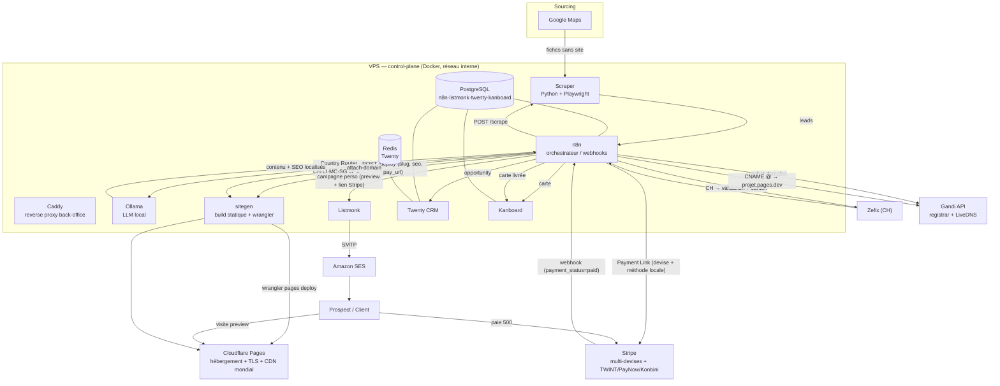
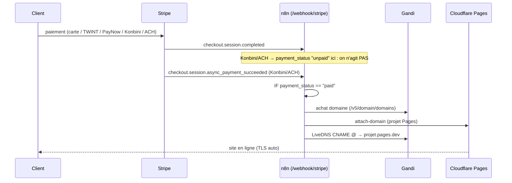

# Architecture

## Flux de données (scraping → génération statique → vente → livraison)

```mermaid
flowchart TD
  subgraph SRC["Sourcing"]
    GM["Google Maps"]
  end

  subgraph VPS["VPS — control-plane (Docker, réseau interne)"]
    CADDY["Caddy<br/>reverse proxy back-office"]
    N8N["n8n<br/>orchestrateur / webhooks"]
    SCR["Scraper<br/>Python + Playwright"]
    OLL["Ollama<br/>LLM local"]
    SG["sitegen<br/>build statique + wrangler"]
    LM["Listmonk"]
    TW["Twenty CRM"]
    KB["Kanboard"]
    PG[("PostgreSQL<br/>n8n·listmonk·twenty·kanboard")]
    RD[("Redis<br/>Twenty")]
  end

  ZEFIX["Zefix (CH)"]
  STRIPE["Stripe<br/>multi-devises + TWINT/PayNow/Konbini"]
  SES["Amazon SES"]
  GANDI["Gandi API<br/>registrar + LiveDNS"]
  CFP["Cloudflare Pages<br/>hébergement + TLS + CDN mondial"]
  CLIENT["Prospect / Client"]

  GM -->|"fiches sans site"| SCR
  N8N -->|"POST /scrape"| SCR
  SCR -->|"leads"| N8N
  N8N -->|"CH → validation + canton"| ZEFIX --> N8N
  N8N -->|"Country Router<br/>CH·LI·MC·SG·JP·US"| OLL
  OLL -->|"contenu + SEO localisés"| N8N
  N8N -->|"Payment Link (devise + méthode locale)"| STRIPE
  N8N -->|"POST /deploy (slug, seo, pay_url)"| SG
  SG -->|"wrangler pages deploy"| CFP
  N8N -->|"opportunity"| TW
  N8N -->|"carte"| KB
  N8N -->|"campagne perso (preview + lien Stripe)"| LM
  LM -->|"SMTP"| SES --> CLIENT

  CLIENT -->|"visite preview"| CFP
  CLIENT -->|"paie 500"| STRIPE
  STRIPE -->|"webhook (payment_status=paid)"| N8N
  N8N -->|"achat domaine"| GANDI
  N8N -->|"attach-domain"| SG --> CFP
  N8N -->|"CNAME @ → projet.pages.dev"| GANDI
  N8N -->|"carte livrée"| KB

  PG --- N8N
  PG --- TW
  PG --- KB
  RD --- TW
```

## Séquence paiement → livraison (Konbini/ACH async gérés)

```mermaid
sequenceDiagram
  participant C as Client
  participant S as Stripe
  participant N as n8n (/webhook/stripe)
  participant G as Gandi
  participant P as Cloudflare Pages
  C->>S: paiement (carte / TWINT / PayNow / Konbini / ACH)
  S->>N: checkout.session.completed
  Note over N: Konbini/ACH → payment_status "unpaid" ici : on n'agit PAS
  S->>N: checkout.session.async_payment_succeeded (Konbini/ACH)
  N->>N: IF payment_status == "paid"
  N->>G: achat domaine (/v5/domain/domains)
  N->>P: attach-domain (projet Pages)
  N->>G: LiveDNS CNAME @ → projet.pages.dev
  P-->>C: site en ligne (TLS auto)
```
