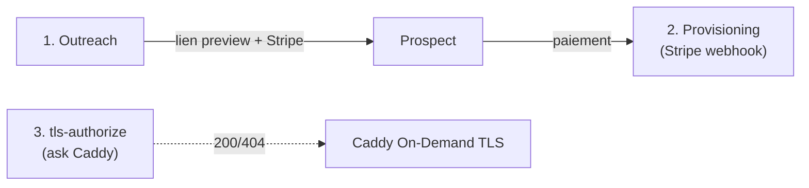

# Workflows n8n

Trois workflows **importables** (JSON) — dans l'UI (`https://$MAIN_DOMAIN/n8n/`) :
*Workflows → Import from File*.

| Fichier | Workflow |
|---------|----------|
| [`1-outreach.json`](1-outreach.json) | Scraping → Zefix (CH) → Country Router → Ollama → WP → Stripe → Listmonk |
| [`2-provisioning.json`](2-provisioning.json) | Webhook Stripe → domaine → mapping WP → `client_domains` → livraison |
| [`3-tls-authorize.json`](3-tls-authorize.json) | Endpoint `ask` de Caddy (autorise le TLS On-Demand) |

Après import : assignez les credentials (Basic Auth WP, Postgres), activez chaque
workflow, et vérifiez que `WEBHOOK_URL` correspond à `https://$MAIN_DOMAIN/`. Les
secrets (Stripe, Cloudflare, WP, Scraper, Listmonk) arrivent par variables
d'environnement du conteneur n8n (voir `.env`), lues via `{{$env.XXX}}`.

> **Enrichissement Zefix (CH)** : un node HTTP « Zefix enrich (CH) » interroge le
> registre du commerce suisse (`config/registries.md`) avant le Country Router. Il
> valide l'entité, récupère l'UID (facturation) et le **canton → langue**
> (`GE/VD/VS/NE/JU/FR → ch_fr`, `TI → ch_it`, sinon `ch_de`). En `onError:
> continueRegularOutput` : hors CH, le workflow continue sans enrichissement.



---

## Workflow 1 — Outreach (génération + campagne)

| # | Node | Rôle |
|---|------|------|
| 1 | **Schedule Trigger** | quotidien, heures ouvrées |
| 2 | **Set — Query** | `query`, `location`, `country` (ex: avocat / Genève / CH) |
| 3 | **HTTP Request → Scraper** | `POST http://scraper:8000/scrape`, header `X-Scraper-Token: {{$env.SCRAPER_TOKEN}}` → leads sans site |
| 4 | **Split In Batches** | itère lead par lead (throttle) |
| 5 | **Function — Country Router** | **cœur du système** (code ci-dessous) : injecte devise, locale, `prompt_key`, `stripe_price_id`, TLD |
| 6 | **HTTP Request → Ollama** | `POST http://ollama:11434/api/generate`, `model=qwen2.5:14b-instruct`, `system` = profil `prompt_key`, `format:"json"` → contenu + SEO |
| 7 | **HTTP Request → WP Provisioner** | `POST https://{{$env.MAIN_DOMAIN}}/wp-json/oueb/v1/sites` (Basic Auth `WP_APP_USER`/`WP_APP_PASSWORD`), `template_id`, `slug`, `seo`, **sans `domain`** (site preview en sous-domaine) → `url` |
| 8 | **HTTP Request → Stripe Payment Link** | `POST https://api.stripe.com/v1/payment_links`, `line_items[0][price]={{$json.stripe_price_id}}`, `metadata[blog_id]`, `metadata[domain_target]`, `metadata[country]` → `payment_url` |
| 9 | **HTTP Request → Listmonk** | crée/So met à jour l'abonné + lance une campagne transactionnelle avec `{{preview_url}}` et `{{payment_url}}` personnalisés |
| 10 | **NoOp / Log** | trace en base |

### Node 5 — Country Router (Function, JavaScript)

```javascript
// Matrice = miroir de config/country_matrix.yaml (gardez-les synchronisées, ou
// chargez le YAML via un node "Read/Parse" au démarrage).
const MATRIX = {
  CH: { currency:'CHF', amount_minor:50000, locale:'de-CH', lang:'de_CH',
        prompt_key:'ch_de', stripe_price_id:'price_CH_chf_500', tld:'.ch' },
  LI: { currency:'CHF', amount_minor:50000, locale:'de-LI', lang:'de_DE',
        prompt_key:'li_de', stripe_price_id:'price_LI_chf_500', tld:'.li' },
  MC: { currency:'EUR', amount_minor:50000, locale:'fr-MC', lang:'fr_FR',
        prompt_key:'mc_fr', stripe_price_id:'price_MC_eur_500', tld:'.mc' },
  SG: { currency:'USD', amount_minor:50000, locale:'en-SG', lang:'en_US',
        prompt_key:'sg_en', stripe_price_id:'price_SG_usd_500', tld:'.sg' },
  JP: { currency:'JPY', amount_minor:79800, locale:'ja-JP', lang:'ja',
        prompt_key:'jp_keigo', stripe_price_id:'price_JP_jpy_79800', tld:'.jp' },
};

// Prompts par marché (miroir de config/prompts.md). Le keigo JP et l'allemand LI
// sont explicitement contraints ici.
const PROMPTS = {
  ch_de: "Schweizer Hochdeutsch, Sie-Form, sachlich, kein 'ß' (immer 'ss'). JSON only.",
  li_de: "Formelles Hochdeutsch, Sie-Form, seriös/diskret (Treuhand, Family Office). JSON only.",
  mc_fr: "Français soutenu, vouvoiement, registre luxe/confidentialité. JSON only.",
  sg_en: "Professional international English (British spelling), premium B2B. JSON only.",
  jp_keigo: "日本語の敬語で作成。丁寧語(です・ます)で統一し、相手には尊敬語、"
          + "自社には謙譲語を用いる。誇張やカタカナ英語を避ける。JSONのみ返す。",
};

const out = [];
for (const item of $input.all()) {
  const lead = item.json;
  const c = (lead.country || '').toUpperCase();
  const m = MATRIX[c];
  if (!m) { continue; }                       // marché non ciblé -> écarté
  out.push({ json: {
    ...lead,
    ...m,
    system_prompt: PROMPTS[m.prompt_key],
    slug: (lead.name || '').toLowerCase().normalize('NFKD')
            .replace(/[^a-z0-9]+/g,'-').replace(/^-|-$/g,'').slice(0,40),
    domain_target: null,                       // rempli après paiement
  }});
}
return out;
```

> Suisse multilingue : pour router la Romandie vers `mc_fr`/`ch_fr` et le Tessin
> vers `ch_it`, ajoutez une détection région (canton / code postal / langue de la
> fiche) avant le lookup et surchargez `prompt_key`.

---

## Workflow 2 — Provisioning (Stripe webhook)

Déclenché à l'encaissement. **Vérifiez la signature Stripe** (`Stripe-Signature`
avec `STRIPE_WEBHOOK_SECRET`) dans le premier node.

| # | Node | Rôle |
|---|------|------|
| 1 | **Webhook** `POST /webhook/stripe` | abonner à `checkout.session.completed` **+** `checkout.session.async_payment_succeeded` |
| 2 | **Function — verify sig** | HMAC SHA-256 sur le raw body ; rejette si invalide |
| 3 | **IF** `data.object.payment_status == "paid"` | ne provisionne QUE si réellement payé (voir Paiements locaux) |
| 4 | **HTTP Request → Cloudflare/Namecheap** | achète `metadata.domain_target` (TLD selon pays), crée l'enregistrement A → IP du VPS |
| 5 | **HTTP Request → WP Provisioner** | rappelle `/wp-json/oueb/v1/sites` (ou un PATCH) avec `domain` = domaine acheté → mappe `wp_blogs.domain` |
| 6 | **Postgres (n8n) INSERT** | `client_domains(domain, blog_id, active=true)` — **table lue par tls-authorize** |
| 7 | **HTTP Request → Listmonk** | email de livraison (identifiants + URL finale) |

---

## Paiements locaux (TWINT / Konbini)

Les méthodes locales sont pilotées par la **devise** via les *automatic payment
methods* de Stripe : activez-les une fois dans le Dashboard (Settings → Payment
methods), et un Payment Link en CHF proposera TWINT, en JPY proposera Konbini —
sans paramètre par requête. `payment_methods` par pays (dans
`config/country_matrix.yaml`) documente ce qu'il faut activer.

| Marché | Méthode locale | Devise requise | Nature |
|--------|----------------|----------------|--------|
| 🇨🇭 CH / 🇱🇮 LI | **TWINT** | CHF ✓ | immédiat |
| 🇯🇵 JP | **Konbini** (paiement en supérette) | JPY ✓ | **asynchrone** |
| 🇲🇨 MC | carte (SEPA/Bancontact en option) | EUR | immédiat |
| 🇸🇬 SG | carte | — | PayNow exigerait du SGD (on facture en USD) |

> ⚠️ **Konbini est asynchrone.** À la validation du checkout, Stripe émet
> `checkout.session.completed` avec `payment_status: "unpaid"` (le client a juste
> reçu un bon à payer en konbini sous quelques jours). Le paiement réel déclenche
> ensuite `checkout.session.async_payment_succeeded`. **Le Workflow 2 provisionne
> uniquement quand `payment_status == "paid"`**, ce qui couvre carte/TWINT
> (immédiat) et Konbini (au paiement effectif) — jamais un site livré avant
> encaissement. Pensez aussi à `checkout.session.async_payment_failed` (voucher
> expiré) pour purger le lead.

## Workflow 3 — tls-authorize (endpoint `ask` de Caddy)

Caddy interroge `GET /webhook/tls-authorize?domain=<host>` AVANT d'émettre un
certificat. On n'autorise QUE les domaines clients payés (présents et actifs dans
`client_domains`). Sans ce garde-fou, n'importe qui pointant un domaine vers votre
IP ferait signer un certificat et épuiserait vos quotas Let's Encrypt.

| # | Node | Rôle |
|---|------|------|
| 1 | **Webhook** `GET /webhook/tls-authorize` | param `domain` |
| 2 | **Postgres SELECT** | `SELECT 1 FROM client_domains WHERE domain = $1 AND active` |
| 3 | **IF trouvé** | → **Respond 200** (Caddy signe) ; sinon → **Respond 404** (refus) |

Réponse : le corps importe peu, seul le **code HTTP** compte (200 = autorisé).
